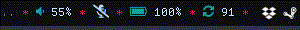

# mic-toggle-polybar

A plugin for the polybar status bar which allows displaying the system's microphone status and (un)muting it with a click.

To add this plugin to polybar, either place `mic-toggle.sh` at `~/.config/polybar`, which is the default config path, or any other path as long as you adjust the path in your polybar config file.

Then add the following to your polybar config:

```
[module/mic-toggle]
type = custom/script
interval = 1

label = %output:0:40:...%
exec = ~/path/to/script  
click-left = ~/path/to/script --click
```

Presently, I'm using Font Awesome and the two icons I specify above are the icons that will display as mic unmuted and mic muted respectively. Seeing as I use the default config path, this is how I use it on my own polybar config:

```
[module/mic-toggle]
type = custom/script
interval = 1

format-padding = 0
format-background = ${colors.background}

format-prefix-foreground = ${colors.header}

label = %output:0:40:...%
exec = ~/.config/polybar/mic-toggle.sh  
click-left = ~/.config/polybar/mic-toggle.sh --click
```

And this is how it looks like:


